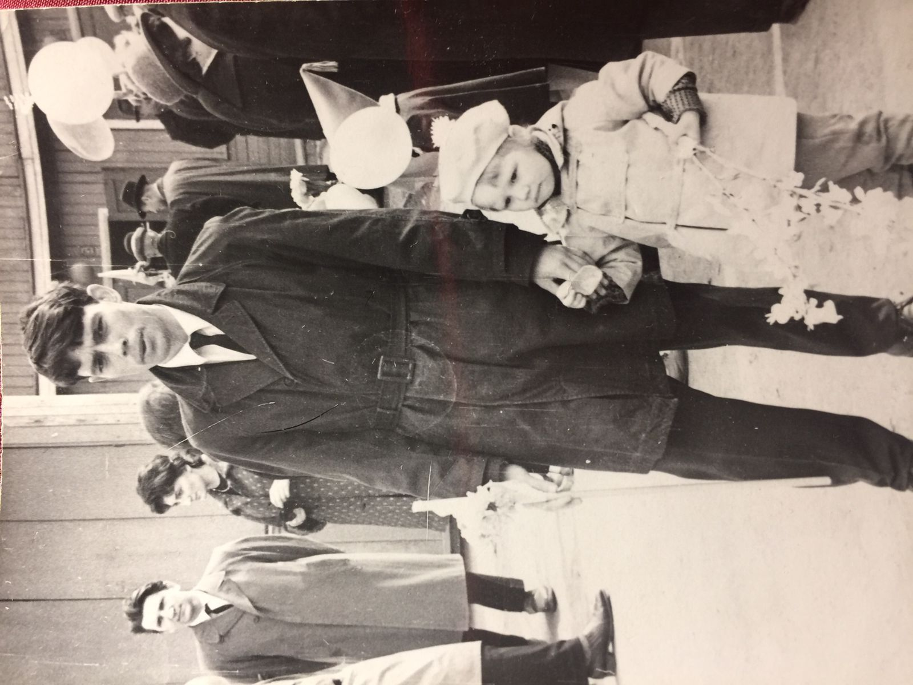
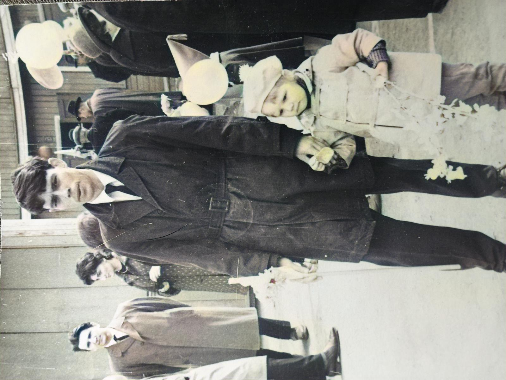
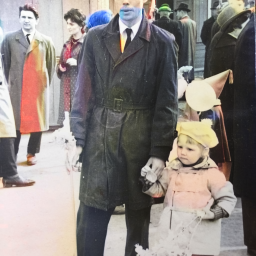
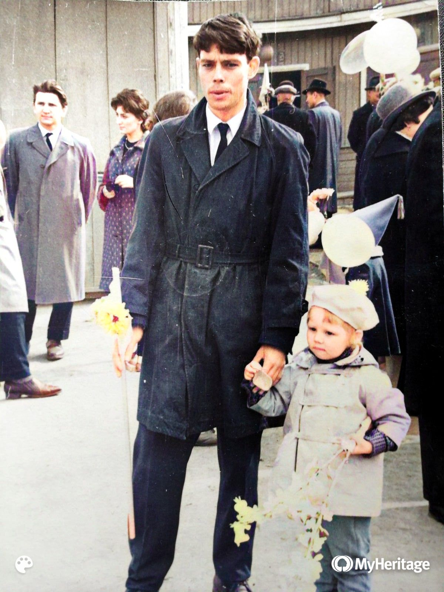

I have recently got a chance to colorize a dozen photos of my grandfather. I wanted to document thre results here as I think they indicate an important pattern in practical AI.

## TLDR
For personal use, choose complete apps and MyHeritage in particular. For industrial one, choose solutions optimized for your problem rather than the SOTA models and DeOldify in particular. When using the newest model, be prepared to spend months ironing out the kinks.

## Models
There are several open-source solutions backed by scientific papers available right now. The ones with the most buzz about them are probably [DeOldify](https://github.com/jantic/DeOldify) and [Colorization Transformer](https://openreview.net/forum?id=5NA1PinlGFu).  

DeOldify is an old horse that has been around for more than 3 years already and all 3 years it was getting better. What is probably even more important it was optimized specifically to work with old photos and videos.  

Colorization Transformer is a new cool kid on the block. One with a very impressive resume, good theoretic backing, developed by Google and beautifully documented results. Those results demonstrate that the model works for colored images which were converted to black-and-white. But is that the same as colorizing old photos?

## Experiment
I'll use just one photo as a demonstration, but I had very similar results with all 12 of them. 
We start with:  

Then we can use [DeOldify colab] (https://colab.research.google.com/github/jantic/DeOldify/blob/master/ImageColorizerColabStable.ipynb) to produce a somewhat boring, but realistic image:

[Colorization Transformer](https://colab.research.google.com/drive/1c8UZL3CkczbIltDxjDfFbq9Y0RnMv93o?usp=sharing) gives us a resized, rescale, cropped, image with random coloring:  

And special improved DeOldify implementation (available at https://myheritage.com/) produces a very decently colored image:

## Conclusions
A well-polished solution for your particular problem will generally beat (actually olbiterate) a new model. If all you have is a scientific prototype, you must understand that a road to a fully production ready system is long and bumpy. And I am not talking about deployment here. I am talking about actually finetuning the solution to your particular domain. And this goes far beyond just finetuning the model and often involves reevaluating every step of the initial solution.  

So when you can use an available service, otherwise try to stick with a battletested (or maybe battle-optimized) solution. And if you actually want to be a trailblazer - prepare for a very bumpy ride (which in business terms means lots and lots of expenses).