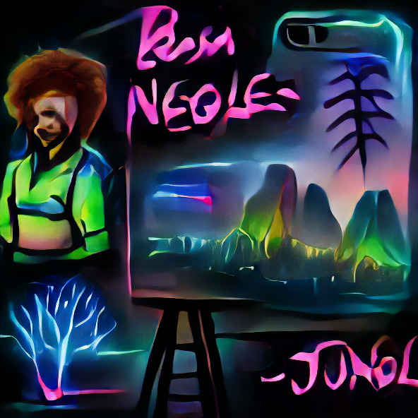

I have 50+ tabs related to this topic and the worst writer's block in years. So instead of writing a full-blown review of the current community efforts to generate images, I'll give a short overview of my thoughts.

To get a basic idea of what I am talking about, look at
https://softologyblog.wordpress.com/2021/11/25/text-to-image-summary-part-5/
https://twitter.com/RiversHaveWings

In the last 9 months, there has been a lot of enthusiasm in the NN community about image generation, specifically, text guided image generation. At his point, this enthusiasm is very much misplaced. We can generate cool images, we can generate psychedelic videos, we can even sell them as [NFTs](https://opensea.io/assets/matic/0x2953399124f0cbb46d2cbacd8a89cf0599974963/36233343970742020275838041650246655519565049475370947438745134314357604220929). But practically, the results are all but useless. And I am not talking about 1 specific type of image generation. You can use VAE, GAN, FLOW, Diffusion, Score and you all will get is a set of very cool wallpapers. Maybe I am missing the point. Maybe the point of art is to get an emotional response, and AI Art does do that. But from a content creation standpoint, there needs to be a different overarching objective than the one we currently see in scientific papers. 

Let's say I want to tell a story. It can be a book, a game, a video, a clip, an interactive novel or something else entirely. But I want the story to be accompanied by images. How do I automate that?

First, I need to enumerate all the images am going to need. (Create a storyboard)  
Then I need to choose a common style for all of them. (Choose a style (what is style?))  
And finally, produce the images. (Generate images)  

## A wrong image generation pipeline
Let's talk automatic image generation. This is the task that the scientific community is trying to solve right now. 
Here is the established pipeline (if we ignore model training and finetuning):

1. Choose a base image
1. Choose a generator
1. Choose an optimizer
1. Choose losses
1. Create a prompt
1. Iterate
1. Get a result

There are two interconnected problems with this approach. 
1. I have little agency in the result.
1. It does not work.

Oh, it does produce cool images. But there is a snowball's chance in hell you are getting a storybook to illustrate anything other than an acid trip. You can get good images with a high amount of detail. They are just not going to be what you want to illustrate or how you want to illustrate, no matter how much you change the prompt or adjust the losses. Again do not think 1 cool image, think a coherent story written by you but told by generated images.
And even if you could do that. Is that as a content creator what you really want? The visuals defined not by you but by the model? Random details you have no control over? 

What I believe to be a better approach is to leave more agency with the human creator and give him a more comprehensive set of tool, a chance to guide the generation, by part of the process and not just as a bystander.

## Image Generation pipeline assisted by AI (or may be assisted by a human)

1. Get a set of base associations/inspirations (We can use the "wrong" pipeline to generate these)
1. Choose a generator
1. Get a rough first iterations
1. Segment images into parts you like and don't like
1. Specify the edits for each part
    1. Specify some new inspiration
    1. Specify things you do NOT want
    1. Embolden parts that are good
    1. Add additional elements to the image
1. Specify the losses for each part

When I imagine a picture, a character, a location, I can usually come up with a number of inspirations: a scene from the movie, a song, a description from the book, a real live photo I took. 
Possible inspirations:
* A text prompt
* A style image
* A content image
* A scribble
* An outline

Once there is a rough first result, I often can point to objects that should be removed or can give a rough sketch (scribble) of a detail I want to be added. Like removing Bob Ross silhouette from a picture generated by 'Happy little tree drawn by Bob Ross' or adding a spaceship to a 'Spaceport on top of an alien ocean'. We actually have the tools to do edits like these. It is just a matter of defining segments of the images and using one of the well-known losses.

I am looking forward to a chance to experiment with [NUWA](https://github.com/microsoft/NUWA) and [DiffusionClip](https://arxiv.org/abs/2110.02711) (despite the bad reviews at https://openreview.net/forum?id=TKMJ9eqtpgP) 

They might be a better backbone for the pipeline I've described above.

Some of my experiments:


